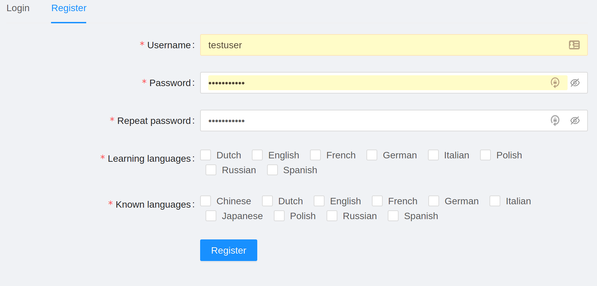
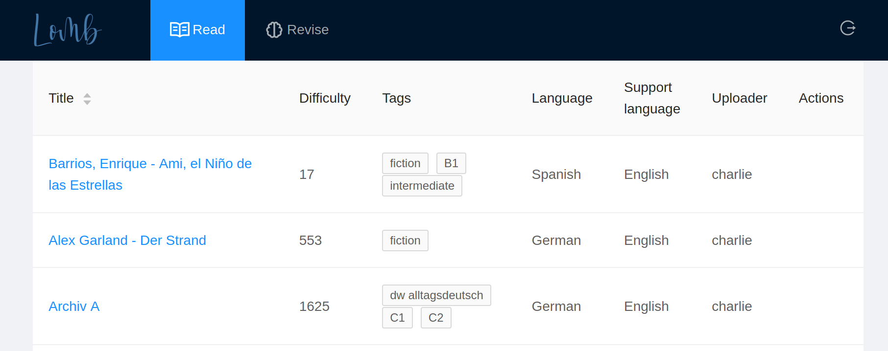
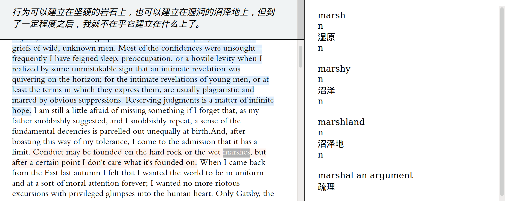
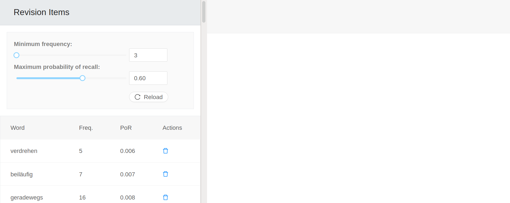
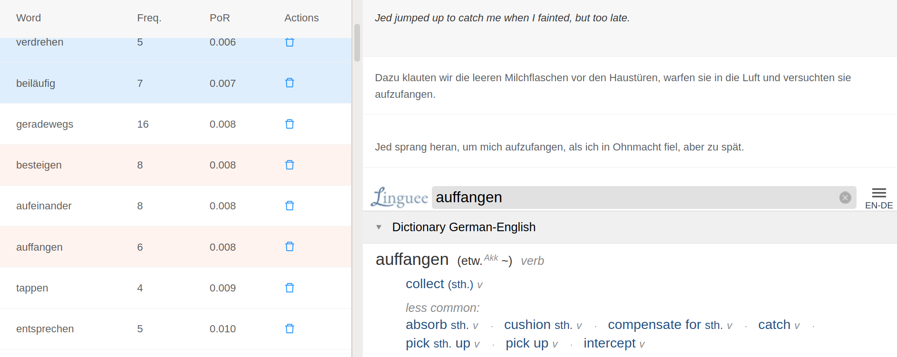

Lomb是一款通过阅读文本学习语言的应用。Lomb的主要理念是利用用户阅读时产生的交互数据来预测哪些单词应该复习。

使用这款应用非常简单。

# 1. 注册

打开注册标签，输入你的用户信息。不要使用敏感的密码，因为服务器并没有进行安全加固。

在这个阶段，最重要的信息是你的 "学习语言 "和 "已知语言"。"学习语言 "指的是你正在学习/有兴趣学习的语言，而 "已知语言 "是用来翻译语句或者定义单词的。

# 2. 选择要阅读的文本。

这很简单，只要在 "阅读 "区域选择即可。

# 3. 使用阅读器。

阅读器使用起来很直观，但需要一些解释。它分为三个区域：读者区、句子翻译板块（位于读者上方）和定义板块（占屏幕右半部分）。

在加载文本时，您可能需要等待10秒钟，以便将样式应用于文本。在这之后，您可以像阅读其他文档一样阅读文本，并进行一些额外的操作。

- 点击一个句子将在翻译面板上显示其翻译。
- 双击（突出显示一个词）将在定义面板上显示其定义。
- 向下滚动将使已读过但未点击的句子变成蓝色。

# 4. 复习

所有被高亮显示的单词都会被默认添加到你的学习词汇中，它们可以在 "复习 "部分进行复习。

{ width=75%}。

有两个参数可以用于个性化的复习环节。

- 频率，这是衡量一个单词重要性的标准（频率较高的单词应该先学习）。如果你只有5分钟的时间来复习，只需使用滑块来研究那些非常频繁的单词，而将不常见的单词留到其他时间来研究。
- 回忆概率(PoR)，也就是估计你记住一个单词的可能性。通常情况下，很久没有阅读或复习过的单词会首先显示。大多数用户会记住高PoR的单词，这通常会是你学习单词的大部分，所以这些单词可以方便地被过滤掉。

如果要复习，只需向下滚动，尽量记住这些单词的意思。如果你记不住某个单词的意思，点击它，就会出现一个字典条目，以及数据库中许多课文中的例子。

{ width=75% }。
